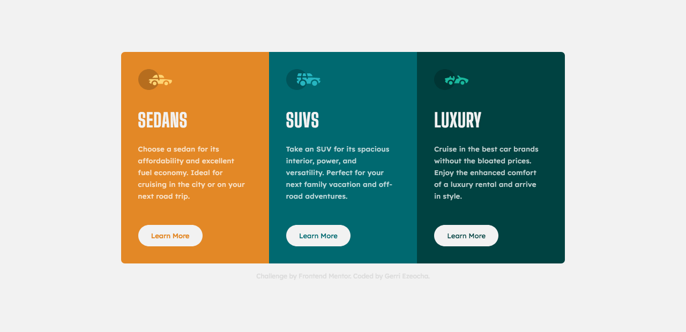

# Frontend Mentor - 3-column preview card component solution

This is a solution to the [3-column preview card component challenge on Frontend Mentor](https://www.frontendmentor.io/challenges/3column-preview-card-component-pH92eAR2-). Frontend Mentor challenges help you improve your coding skills by building realistic projects. 

## Table of contents

- [Overview](#overview)
  - [The challenge](#the-challenge)
  - [Screenshot](#screenshot)
  - [Links](#links)
- [My process](#my-process)
  - [Built with](#built-with)
  - [What I learned](#what-i-learned)
  - [Continued development](#continued-development)
  - [Useful resources](#useful-resources)
- [Author](#author)
- [Acknowledgments](#acknowledgments)

**Note: Delete this note and update the table of contents based on what sections you keep.**

## Overview

### The challenge

Users should be able to:

- View the optimal layout depending on their device's screen size
- See hover states for interactive elements

### Screenshot

Above are final results of desktop and mobile previews.

### Links

- Solution URL: [Add solution URL here](https://your-solution-url.com)
- Live Site URL: [Add live site URL here](https://your-live-site-url.com)

## My process

### Built with

- Semantic HTML5 markup
- CSS custom properties
- Sass preprocessor
- Flexbox

### What I learned
I was having some trouble with my body layout and realized that
the order of which I was writing my global sizes in CSS contributed to this.

### Useful resources

- [Resource 1](https://www.wesbos.com) - I have been working through some of Wes's Courses and it has been very helpful in understanding an overall concept and ways to tailor my approach. His approach helped me figure out my sizing issues.

## Author

- Website - [Gerri Ezeocha](gerriezeocha.netlify.app)
- Frontend Mentor - [@GerriEzeocha](https://www.frontendmentor.io/profile/yourusername)

